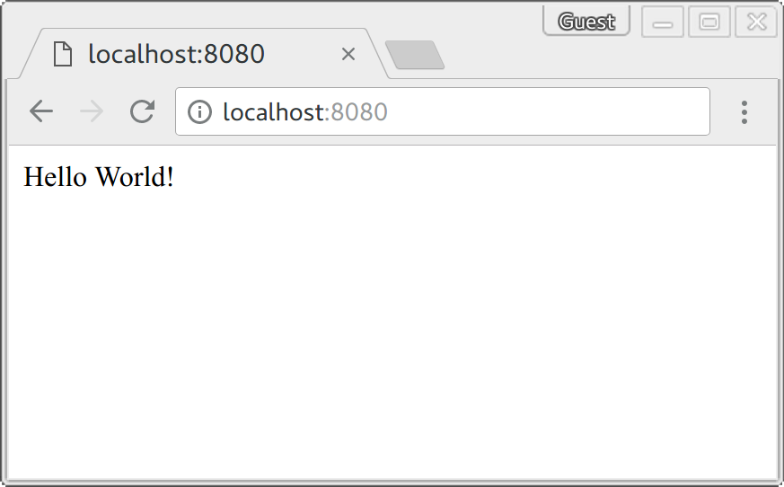

# Docker Nginx PHP Example

[![Software License][ico-license]](LICENSE.md)
[![PHP Version][ico-php-version]](https://hub.docker.com/_/php)
[![NGINX Version][ico-nginx-version]](https://hub.docker.com/_/nginx)

This is a simple example for running a docker container with PHP-FPM and NGINX.

## Get it up and running

[Install docker on your machine.][install-docker]

[Install docker-compose on your machine.][install-docker-compose]

Clone this repository.

``` bash
$ git clone https://github.com/mhilker/docker-nginx-php-example
```

Switch to the cloned directory.

``` bash
$ cd docker-nginx-php-example
```

Start the stack.

``` bash
$ docker-compose up
```

You should see an output like this.

``` bash
Creating network "docker-nginx-php-example_default" with the default driver
Building php
Step 1/4 : FROM php:7.4.3-fpm-alpine3.11
7.4.3-fpm-alpine3.11: Pulling from library/php
c9b1b535fdd9: Already exists
c1c0a1817bec: Already exists
cdd5b3ea1fc3: Already exists
db87396003bd: Already exists
e54241183f8c: Pull complete
5a9f10e025a9: Pull complete
1661a47af75d: Pull complete
80a3db629727: Pull complete
1f51304a39ad: Pull complete
53730f2af539: Pull complete
Digest: sha256:a748390f2d9f006a0bed261f751656ea49c8f040f664038fe7a47bab44f61212
Status: Downloaded newer image for php:7.4.3-fpm-alpine3.11
 ---> 014a46b60a9d
Step 2/4 : COPY ./docker/php/php-fpm.conf /usr/local/etc/php-fpm.d/www.conf
 ---> 42b544495f58
Step 3/4 : COPY . /app
 ---> f995a88c04d4
Step 4/4 : VOLUME ["/app"]
 ---> Running in 0f07703b8e4e
Removing intermediate container 0f07703b8e4e
 ---> ecf01e977834
Successfully built ecf01e977834
Successfully tagged docker-nginx-php-example_php:latest
Building web
Step 1/3 : FROM nginx:1.17.8-alpine
1.17.8-alpine: Pulling from library/nginx
4167d3e14976: Pull complete
db94a93dfca0: Pull complete
Digest: sha256:9e81b8f9cef5a095f892183688798a5b2c368663276aa0f2be4b1cd283ace53d
Status: Downloaded newer image for nginx:1.17.8-alpine
 ---> 48c8a7c47625
Step 2/3 : COPY ./public/ /app/public/
 ---> 39d5b48ed79e
Step 3/3 : COPY ./docker/nginx/nginx.conf /etc/nginx/conf.d/default.conf
 ---> 218b81157055
Successfully built 218b81157055
Successfully tagged docker-nginx-php-example_web:latest
Creating docker-nginx-php-example_php_1 ... done
Creating docker-nginx-php-example_web_1 ... done
Attaching to docker-nginx-php-example_php_1, docker-nginx-php-example_web_1
php_1  | [24-Oct-2019 20:12:27] NOTICE: fpm is running, pid 1
php_1  | [24-Oct-2019 20:12:27] NOTICE: ready to handle connections
```

Visit `localhost:8080` in your browser. You should see an output like this.



## License

The MIT License (MIT). Please see [License File](LICENSE.md) for more information.

[ico-license]: https://img.shields.io/badge/license-MIT-brightgreen.svg?style=flat-square
[ico-php-version]: https://img.shields.io/badge/PHP-7.4--fpm-blue?style=flat-square
[ico-nginx-version]: https://img.shields.io/badge/NGINX-1.17-green?style=flat-square
[install-docker]: https://docs.docker.com/engine/installation
[install-docker-compose]: https://docs.docker.com/compose/install
